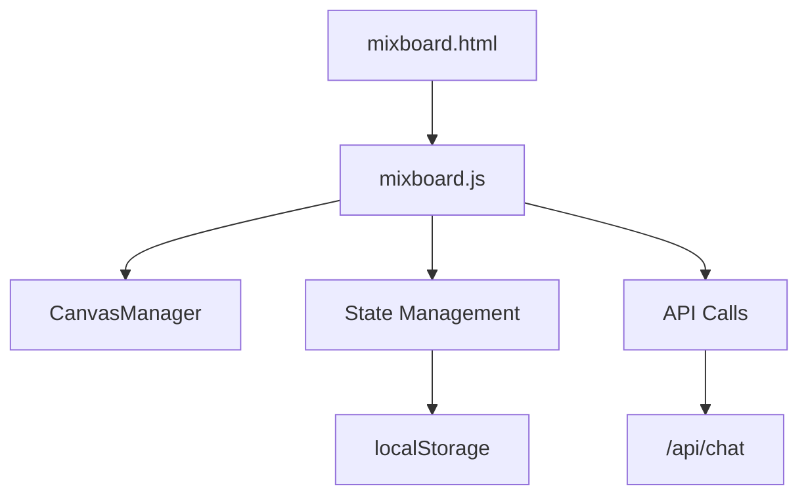
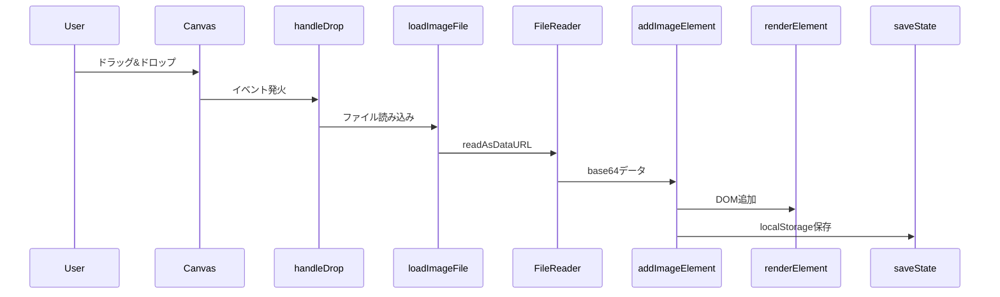
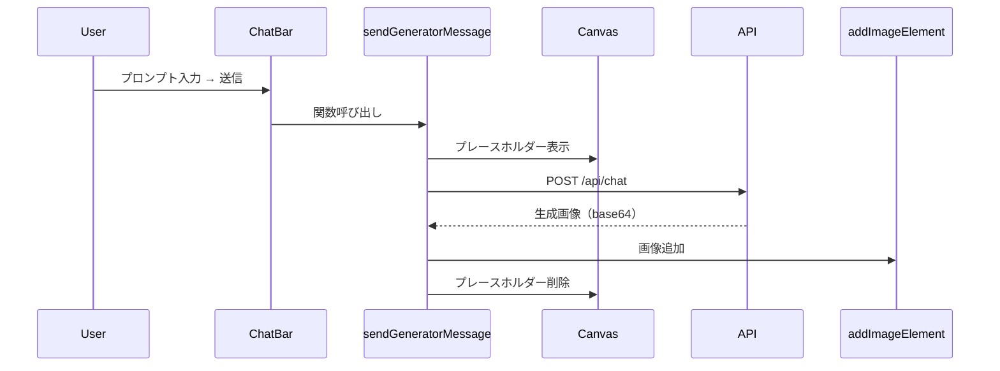

# Mixboard 技術仕様書

> **コードレビュー用ドキュメント**  
> 作成日: 2024-12-18

---

## 概要

Mixboardは、キャンバス上に画像やテキストを自由に配置し、AIを使って画像生成・編集ができるバナー作成ツールです。

### ファイル構成

```
tools/mixboard/
├── mixboard.html   # UI構造
├── mixboard.css    # スタイリング
└── mixboard.js     # ロジック（約960行）
```

---

## アーキテクチャ



### 状態管理

```javascript
// グローバル状態（mixboard.js内）
let elements = [];           // キャンバス上の全要素
let selectedElementIds = []; // 選択中の要素ID（複数選択対応）
let currentTool = 'select';  // 現在のツール
let zoomScale = 1;           // ズーム倍率
let isGenerating = false;    // 画像生成中フラグ
```

---

## 主要機能

### 1. ツール切り替え

| ツール | キー | 機能 |
|--------|------|------|
| 選択 | V | 要素の選択・移動 |
| ハンド | H | キャンバスのパン操作 |
| テキスト | T | テキスト要素の追加 |

**実装箇所:** `setCurrentTool(tool)` 関数

### 2. 複数選択

- **Shift+クリック**で複数要素を選択可能
- `selectedElementIds` 配列で管理
- 選択数に応じてプレースホルダーテキストが変化

**実装箇所:** `selectElement(id, addToSelection)` 関数

### 3. 画像操作

| 操作 | ショートカット | 関数 |
|------|---------------|------|
| 複製 | Cmd/Ctrl+D | `duplicateElement()` |
| ダウンロード | - | `downloadElement()` |
| 削除 | Delete/Backspace | `deleteElement()` |
| 再生成 | - | `refreshElement()` |
| 編集 | ダブルクリック | `editElement()` → `openRevisionMode()` |

### 4. 画像生成（API連携）

```javascript
// 下部チャットバーから画像生成
async function sendGeneratorMessage() {
    // 1. 生成中プレースホルダーを表示
    const placeholder = createGeneratingPlaceholder(placeholderId);
    
    // 2. API呼び出し
    const response = await fetch(`${API_BASE_URL}/chat`, {
        method: 'POST',
        body: JSON.stringify({
            message: text,
            images: selectedImages,  // 複数画像対応
            canvasSize: '1080x1080',
            projectType: 'mixboard',
            generateImage: true
        })
    });
    
    // 3. 生成画像をキャンバスに追加
    result.generatedImages.forEach((imgSrc, index) => {
        addImageElement(imgSrc, 150 + index * 30, 150 + index * 30, true);
    });
}
```

### 5. 状態永続化

- **保存先:** `localStorage`
- **キー:** `mixboard_project_v2`
- **保存タイミング:** 要素追加/削除/移動/編集時

```javascript
function saveState() {
    localStorage.setItem(STORAGE_KEY, JSON.stringify({
        elements,
        updatedAt: new Date().toISOString()
    }));
}
```

> ⚠️ **既知の問題:** 大きなbase64画像でlocalStorageがオーバーフローする可能性あり

---

## UI コンポーネント

### レイアウト構造

```
+--------------------------------------------------+
|  Header (戻る | プロジェクト名 | Share | Transform) |
+--------+--------------------------------+---------+
|        |                                |         |
| 左パネル|          キャンバス            | 右パネル |
| (参考) |                                | (チャット)|
|        |  [左ツールバー]    [ズーム]     |         |
|        |                                |         |
|        |       [下部チャットバー]        |         |
+--------+--------------------------------+---------+
```

### フローティングツールバー

画像選択時に要素上部に表示:
- リフレッシュ / 編集 / 複製 / ダウンロード / 削除

---

## CSS設計

### カラースキーム

```css
--color-accent: #7c3aed;        /* 紫（メインアクセント） */
--color-accent-hover: #6d28d9;  /* 紫（ホバー時） */
--color-gray-900: #171717;      /* ダーク */
```

### 主要クラス

| クラス | 用途 |
|--------|------|
| `.canvas-element` | キャンバス上の要素 |
| `.canvas-element.selected` | 選択状態 |
| `.generating-placeholder` | 生成中表示 |
| `.element-toolbar` | 画像選択時ツールバー |
| `.bottom-chat-bar` | 下部チャット |

---

## イベントフロー

### 画像追加フロー



### 画像生成フロー



---

## キーボードショートカット

| キー | 機能 |
|------|------|
| V | 選択ツール |
| H | ハンドツール |
| T | テキストツール |
| Delete/Backspace | 選択要素を削除 |
| Cmd/Ctrl + D | 選択要素を複製 |
| Escape | 選択解除 / 編集モード終了 |

---

## 改善提案

### 対応済み（2024-12-18 レビューフィードバック）

| 指摘内容 | 対応 |
|---------|------|
| 修正オーバーレイ保存ボタン未実装 | `saveRevision()` 関数を追加、API連携・画像差し替え実装 |
| localStorage溢れ対策 | `QuotaExceededError` 時にトースト通知、サイズ警告追加 |
| 複数選択時の一括ドラッグ未対応 | `dragStartPositions` で開始位置を記録し全要素を平行移動 |
| テキストスタイル同期なし | `syncTextStyleFromElement()` で選択要素のスタイルをツールバーに反映 |

### 今後の改善候補

1. **IndexedDB移行** - localStorageの5MB制限を回避
2. **画像圧縮** - base64保存前にリサイズ
3. **Undo/Redo** - 操作履歴の追加

---

## テスト観点

- [ ] 画像ドラッグ&ドロップでキャンバスに追加される
- [ ] Shift+クリックで複数選択できる
- [ ] 選択画像のプレビューが下部チャットに表示される
- [ ] 画像生成時にプレースホルダーが表示される
- [ ] ページリロード後も要素が復元される
- [ ] 複製/削除/ダウンロードが正常に動作する
