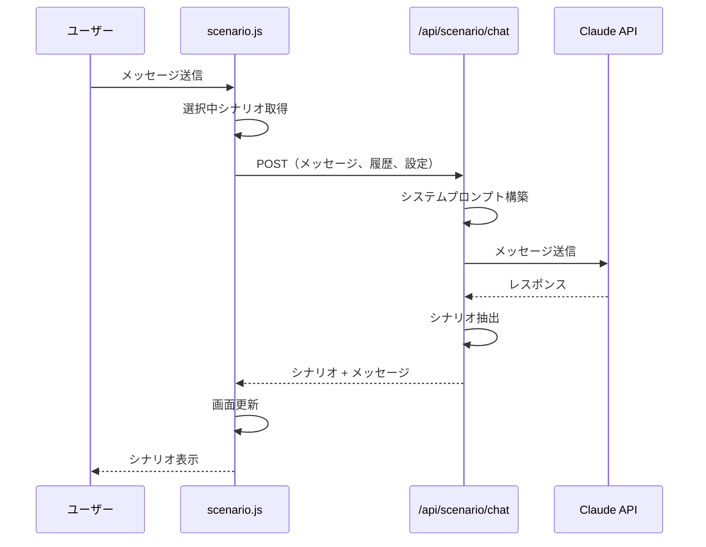
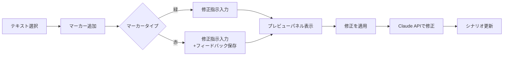
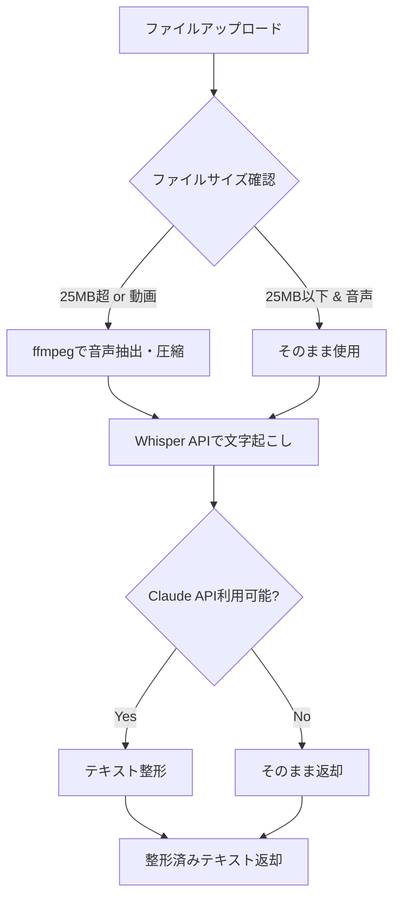

# シナリオ作成ツール 動作仕様書

> **ドキュメントバージョン**: 1.0  
> **最終更新日**: 2024-12-18  
> **対象ファイル**: `tools/scenario/scenario.html`, `scenario.js`, `scenario.css`  
> **バックエンドAPI**: `server/src/routes/scenario.js`

---

## 1. 概要

シナリオ作成ツールは、広告・マーケティング用のシナリオ（ストーリー性のある広告文）をAI（Claude）と対話しながら作成・編集するためのWebアプリケーションです。

### 1.1 主要機能

| 機能カテゴリ | 機能名 | 説明 |
|-------------|--------|------|
| シナリオ生成 | AIチャット | Claude APIを使用した対話型シナリオ生成 |
| 参照管理 | 好調シナリオ | 過去の成功シナリオを参照として活用 |
| 編集機能 | マーカー機能 | テキスト選択による部分修正指示 |
| 入力補助 | 動画文字起こし | 動画/音声ファイルからのテキスト抽出 |
| プロジェクト管理 | タブ機能 | 複数シナリオの並行作業 |

---

## 2. 画面構成

```
┌─────────────────────────────────────────────────────────────────────┐
│ ヘッダー: シナリオ作成 [件数バッジ]                                    │
├─────────────────────────────────────────────────────────────────────┤
│ タブバー: [シナリオ1] [シナリオ2] [+]                                 │
├──────────────┬────────────────────────────────┬─────────────────────┤
│ 左パネル      │ 中央エリア                     │ 右パネル            │
│              │                                │                     │
│ ■好調シナリオ │ ■マーカーツールバー            │ ■任意設定（折りたたみ）│
│ [案件選択]    │ [緑][赤][プレビュー][クリア]   │ ・ターゲット        │
│              │                                │ ・訴求軸            │
│ ・シナリオ1   │ ■シナリオ表示エリア            │ ・詳細              │
│ ・シナリオ2   │                                │                     │
│ ・シナリオ3   │ 【シナリオ1】                  │ ■チャットエリア      │
│   ...        │ 本文が表示される...             │ [メッセージ履歴]    │
│              │                                │                     │
│ [+新規登録]   │ ■修正プレビューパネル          │ [案件][件数]        │
│              │ （スライドイン）               │ [入力欄] [送信]     │
└──────────────┴────────────────────────────────┴─────────────────────┘
```

### 2.1 パネル詳細

#### 左パネル（好調シナリオ選択）
- **目的**: 過去の成功シナリオを参照として選択
- **案件タイプ**: 債務整理 / 失業保険 / クリニック
- **操作**: クリックで選択（複数選択可）、ダブルクリックで詳細表示

#### 中央エリア（シナリオ表示）
- **目的**: 生成されたシナリオの表示・編集
- **機能**: マーカー機能、直接編集、コピー、追加/複製/削除

#### 右パネル（チャット）
- **目的**: AIとの対話によるシナリオ生成
- **入力**: テキスト、画像添付（参考資料）

---

## 3. 機能詳細

### 3.1 AIチャット機能

#### リクエストフロー



#### リクエストパラメータ

| パラメータ | 型 | 必須 | 説明 |
|-----------|-----|------|------|
| message | string | ○ | ユーザーメッセージ |
| conversationHistory | array | × | 会話履歴（role/content） |
| projectType | string | × | 案件タイプ（default: "debt"） |
| generationCount | number | × | 生成件数（1-5） |
| selectedScenarios | array | × | 選択中の好調シナリオ |
| presets | object | × | 任意設定（target, appeal, details） |
| images | array | × | 添付画像（Base64） |

#### レスポンス形式

```json
{
  "message": "AIからのメッセージ全文",
  "scenario": ["シナリオ1本文", "シナリオ2本文"],
  "conversationHistory": [...]
}
```

#### シナリオ抽出ルール

AIの出力から以下のタグで囲まれた部分を抽出：

```
<<<SCENARIO_START>>>
【シナリオ1】
本文...

---

【シナリオ2】
本文...
<<<SCENARIO_END>>>
```

---

### 3.2 マーカー機能

シナリオの一部を選択し、修正指示を与える機能。

#### マーカータイプ

| タイプ | 色 | 用途 | 永続化 |
|--------|-----|------|--------|
| 緑マーカー | 緑 | 単発修正 | なし |
| 赤マーカー | 赤 | 永続修正（今後の生成に反映） | あり |

#### 修正フロー



#### API: `/api/scenario/correct-batch`

一括修正用エンドポイント。複数マーカーをまとめて処理。

| パラメータ | 型 | 説明 |
|-----------|-----|------|
| originalContent | string | 元のシナリオ本文 |
| corrections | array | 修正指示の配列 |
| corrections[].selectedText | string | 選択テキスト |
| corrections[].instruction | string | 修正指示 |
| corrections[].type | string | "green" or "red" |
| feedbackRules | array | 永続修正ルール（赤マーカー） |

---

### 3.3 好調シナリオ管理

#### CRUD操作

| 操作 | API | メソッド | 説明 |
|------|-----|----------|------|
| 一覧取得 | `/api/scenario/list` | GET | 案件別シナリオ一覧 |
| 詳細取得 | `/api/scenario/detail` | GET | シナリオ本文取得 |
| 保存 | `/api/scenario/save` | POST | 新規シナリオ保存 |
| 更新 | `/api/scenario/update` | PUT | シナリオ編集 |
| 削除 | `/api/scenario/delete` | DELETE | シナリオ削除 |

#### ファイル保存先

```
server/scenarios/
├── debt/          # 債務整理
│   ├── scenario_001.json
│   └── scenario_002.json
├── unemployment/  # 失業保険
└── clinic/        # クリニック
```

#### ファイル形式

```json
{
  "name": "シナリオ名",
  "content": "シナリオ本文...",
  "createdAt": "2024-12-18T12:00:00.000Z",
  "updatedAt": "2024-12-18T12:00:00.000Z"
}
```

---

### 3.4 動画文字起こし

#### API: `/api/scenario/transcribe`

| 項目 | 説明 |
|------|------|
| 対応形式 | MP4, MOV, AVI, MKV, WEBM, MP3, WAV |
| 最大サイズ | 100MB |
| 使用API | OpenAI Whisper API |

#### 処理フロー



#### 整形ルール

1. 句点「。」の直後で改行
2. 長文の読点「、」後も改行
3. フィラー（えー、あー等）削除
4. 誤字脱字修正
5. 句読点の適切な追加

---

### 3.5 プロジェクト（タブ）管理

#### データ構造

```javascript
// LocalStorage: "scenario_projects"
{
  "projects": [
    {
      "id": 1,
      "name": "シナリオ 1",
      "chatHistory": [...],      // 会話履歴
      "scenarioContent": "...",  // 生成シナリオ
      "projectType": "debt"      // 案件タイプ
    }
  ],
  "currentProjectId": 1,
  "deletedProjects": []
}
```

#### タブ操作

| 操作 | 説明 |
|------|------|
| 新規タブ | [+] ボタンで新規プロジェクト作成 |
| 切り替え | タブクリックでプロジェクト切り替え |
| 名前変更 | タブダブルクリックで編集モード |
| 削除 | タブ内の [×] で削除（ゴミ箱へ移動） |

---

## 4. データ永続化

### 4.1 LocalStorage キー

| キー | 用途 | 有効期限 |
|------|------|----------|
| `scenario_projects` | プロジェクト一覧・状態 | なし |
| `scenario_feedback` | 赤マーカーのフィードバック | なし |

### 4.2 サーバーサイドファイル

| ディレクトリ | 用途 |
|-------------|------|
| `server/scenarios/{projectType}/` | 好調シナリオJSONファイル |
| `server/uploads/` | アップロードファイル（一時） |

---

## 5. エラーハンドリング

### 5.1 API エラーコード

| ステータス | 状況 | ユーザー通知 |
|-----------|------|-------------|
| 503 | Claude API未初期化 | 「APIキーを確認してください」 |
| 503 | OpenAI API未初期化 | 「OpenAI APIキーを確認してください」 |
| 400 | パラメータ不正 | 「入力を確認してください」 |
| 500 | サーバーエラー | 「エラーが発生しました」 |

### 5.2 フロントエンドエラー

- ネットワークエラー: リトライ促進メッセージ
- LocalStorageクォータ超過: 古いプロジェクト削除提案

---

## 6. 使用API一覧

### 6.1 外部API

| API | 用途 | 必要なキー |
|-----|------|-----------|
| Anthropic Claude | シナリオ生成・修正・整形 | `ANTHROPIC_API_KEY` |
| OpenAI Whisper | 音声文字起こし | `OPENAI_API_KEY` |

### 6.2 内部API エンドポイント

| メソッド | パス | 機能 |
|----------|------|------|
| GET | `/api/scenario/list` | シナリオ一覧取得 |
| GET | `/api/scenario/detail` | シナリオ詳細取得 |
| POST | `/api/scenario/save` | シナリオ保存 |
| PUT | `/api/scenario/update` | シナリオ更新 |
| DELETE | `/api/scenario/delete` | シナリオ削除 |
| POST | `/api/scenario/chat` | AIチャット |
| POST | `/api/scenario/correct` | 単発修正 |
| POST | `/api/scenario/correct-batch` | 一括修正 |
| POST | `/api/scenario/transcribe` | 動画文字起こし |

---

## 7. 技術スタック

| レイヤー | 技術 |
|---------|------|
| フロントエンド | Vanilla JavaScript, CSS |
| バックエンド | Node.js, Express |
| AI | Claude API (claude-sonnet-4-5-20250929) |
| 音声処理 | OpenAI Whisper, ffmpeg |
| データ保存 | LocalStorage, JSON files |

---

## 8. セキュリティ対策

### 8.1 XSS対策

| 関数 | 用途 |
|------|------|
| `escapeHtmlStrict()` | 全てのHTML特殊文字をエスケープ（&lt;, &gt;, &amp;, &quot;, &#039;） |
| `sanitizeHtml()` | 許可されたタグのみ残しつつ危険な要素・属性を除去 |

**適用箇所:**
- `addMessage()`: チャットメッセージ表示時
- `renderScenarioContent()`: シナリオ本文表示時
- `renderTabs()`: タブ名表示時

### 8.2 許可されるHTMLタグ

```javascript
const ALLOWED_TAGS = ['br', 'p', 'strong', 'em', 'b', 'i', 'ul', 'ol', 'li', 
                      'h1', 'h2', 'h3', 'h4', 'h5', 'h6', 'code', 'pre', 'blockquote'];
```

---

## 9. 今後の改善点

> [!NOTE]
> 以下は現状の実装で検出された改善可能な点です

1. **IndexedDB移行**: LocalStorageの容量制限対策
2. **オフライン対応**: Service Workerによるキャッシュ
3. **リアルタイム同期**: 複数タブ間のデータ同期
4. **undo/redo強化**: より詳細な履歴管理

---

## 付録: ファイル構成

```
tools/scenario/
├── scenario.html     # メインHTML（332行）
├── scenario.css      # スタイルシート（45KB）
├── scenario.js       # メインスクリプト（2094行, 85KB）
└── SPECIFICATION.md  # 本仕様書

server/src/routes/
└── scenario.js       # APIルート（561行）
```
